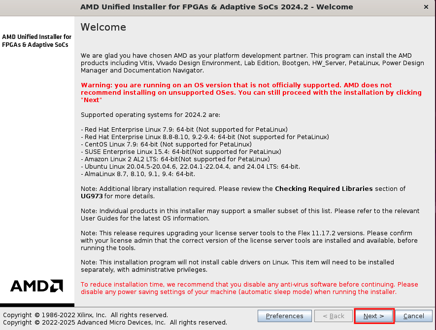
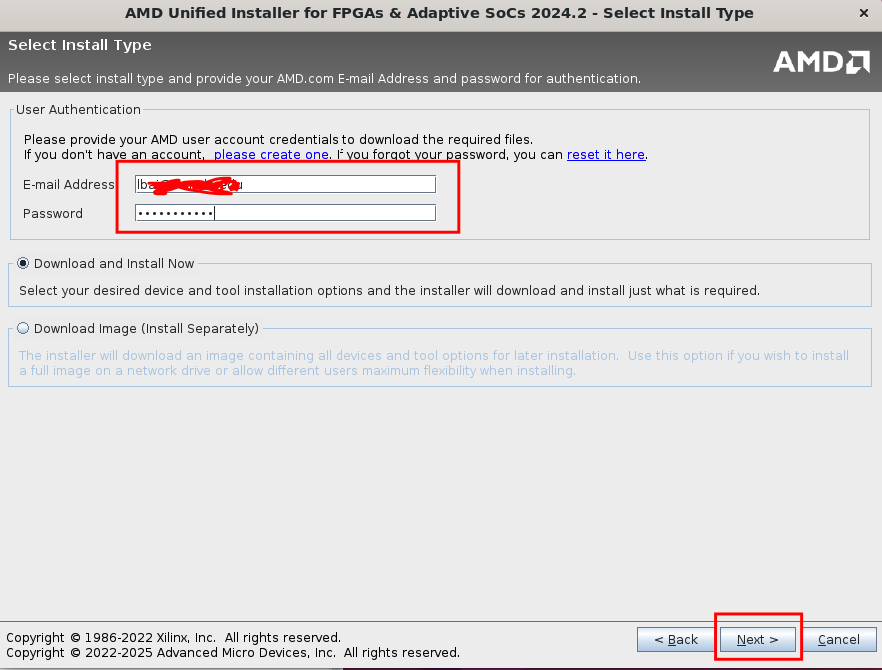
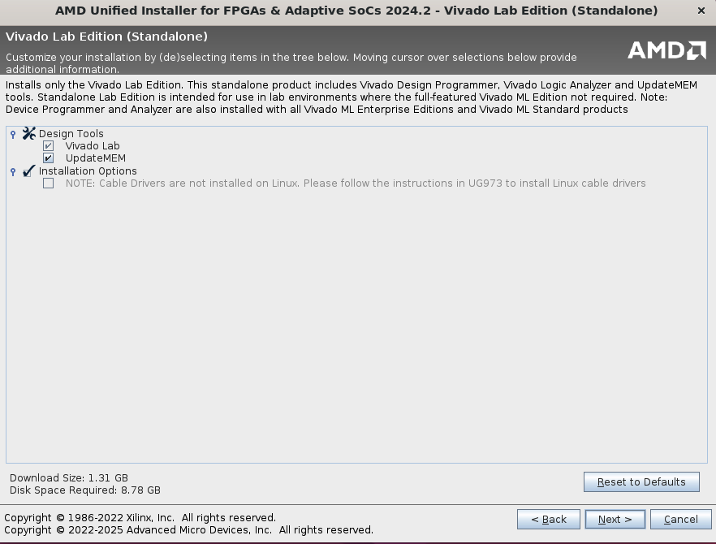
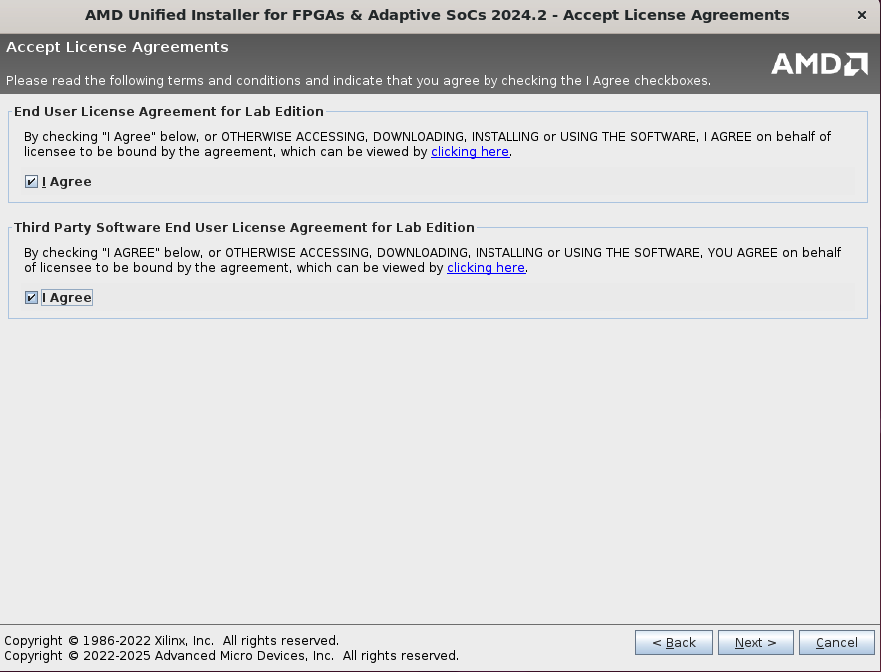
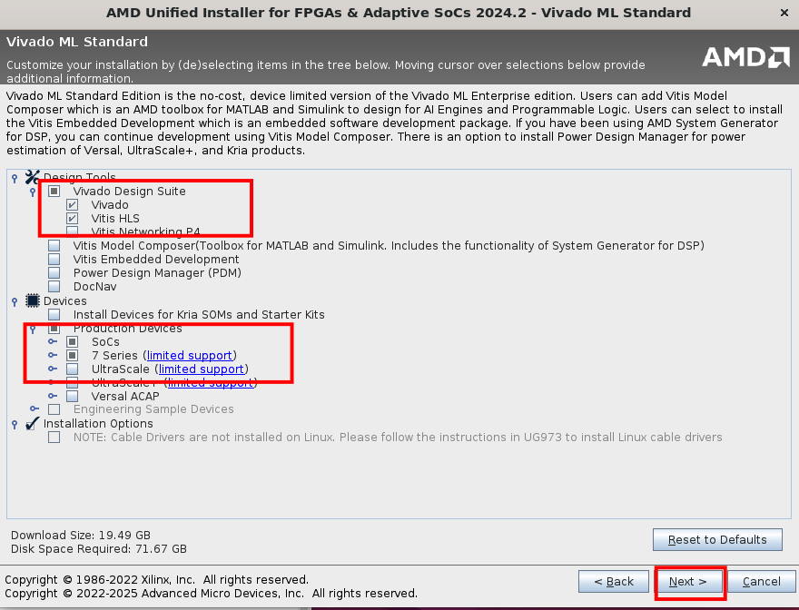
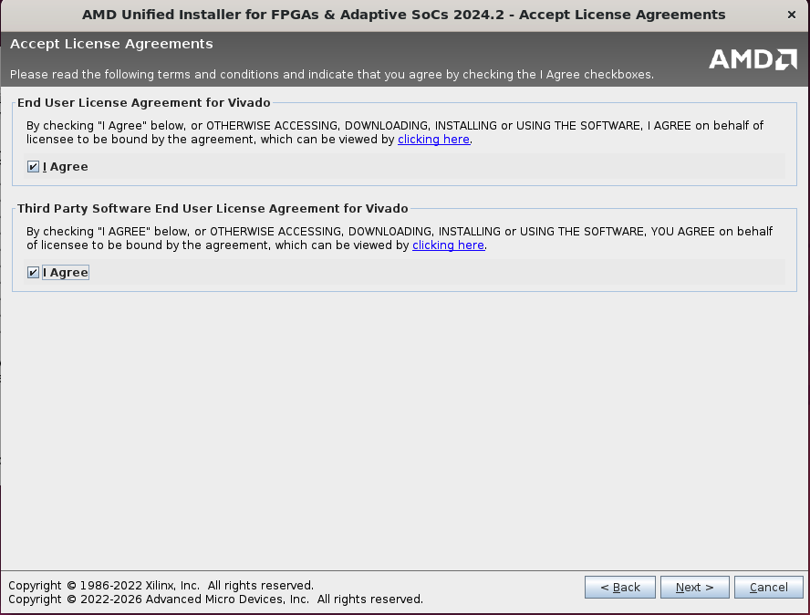
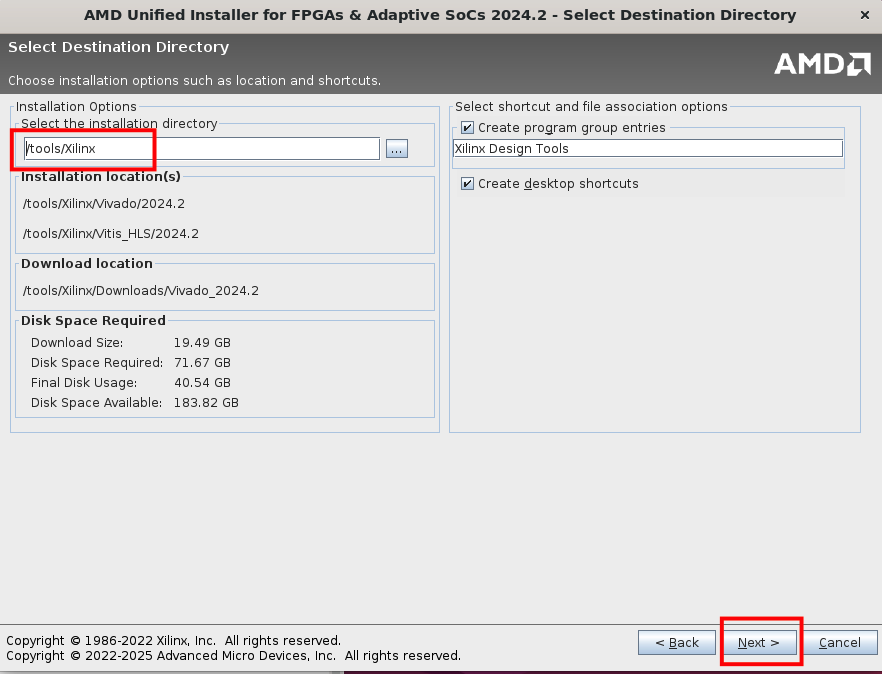
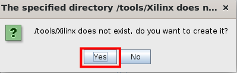
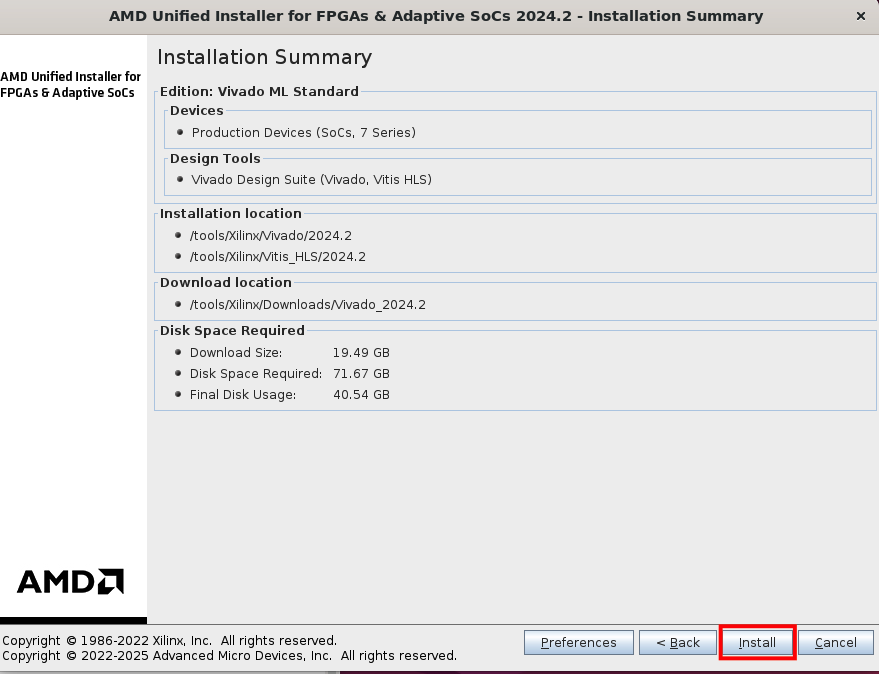

# Cloud 9 setup
Instruction is provided at https://sites.google.com/a/temple.edu/ece2612/home/cloud9-setup

# after you select the instance for cloud9, in the terminal
```
sudo apt update && sudo apt upgrade -y
sudo reboot
```

After login back, we can do
```
git clone -b vivado https://github.com/lbaitemple/ece2613 
cd ece2613
bash ./setup.bash 
sudo reboot
```

# Install Vivado

- create a xilinx account at https://www.amd.com/en/registration/create-account.html
- activate your acccount
- open x-windows in cloud9
- run the following commands and make sure you install the package in /opt/xilinx folder
  
  ```
  cd ~/environment/ece2613
  sudo ./FPGAs_AdaptiveSoCs_Unified_2024.2_1113_1001_Lin64.bin
  
  ```

## Log in using your AMD credential



## Select vivado installation






  











# Test the code
- right click on m_sim (extension file) and run

- right click on qsf (extension file) and run

<!---
### wireless
```
cd wireless
docker-compose build
docker run -it bionic-bai:latest /bin/bash
```
--->
